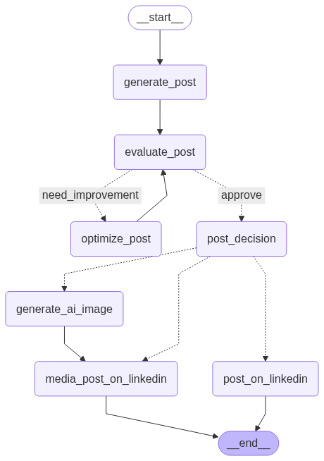

#  topic2linkedin_ai

An autonomous AI agent that generates, evaluates, optimizes, and posts content on **LinkedIn** — powered by **LangChain**, **LangGrapg**, and intelligent workflow decision logic.

---




##  Project Summary

This project allows a user to simply provide a **topic**, and the AI takes care of:
-  **Writing a compelling post**
-  **(Optionally) Generating a relevant image using AI**
-  **Posting it directly on LinkedIn**

All steps are done automatically, with no human input needed after giving the topic.

---

##  How It Works

1. **Input**: Provide a topic (e.g., `"AI bot that writes and posts on Reddit automatically"`).
2. **Generate**: AI writes the post content using LangChain.
3. **Decision Engine**: Based on the state, it:
   - Posts with or without an image,
   - Or generates the image if required.
4. **Post**: The final content is uploaded to LinkedIn.

---

##  Tech Stack

-  **LangChain**
-  **Together AI**
-  **Python 3.10+**
-  **Workflow state engine (custom logic)**

---

## Remeber to add and set all the api key of your Linkedin Oauth secerets and also set api key models


##  Folder Structure

```bash
Project/
├── generated_image        # ai generated image
├── Linkedin.ipynb   # linkedin agent file ( main file )
├── Readme.md        # description of the project , how to use it
├── output.png       # ai agent graph